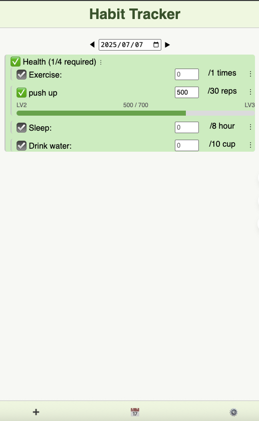

🌱 Habit Tracker

**Description**: Personal habit tracking app built with React + Vite + Firebase  
**Website**: [https://sunny-habit-app.web.app/](https://sunny-habit-app.web.app/)  
**Topics**: react, habit-tracker, firebase, productivity, vite

# 🌱 Habit Tracker

A full-featured habit tracking app built with **React + Vite** and powered by **Firebase** for authentication and real-time cloud storage.

Users can create daily habits, group them, track progress, and unlock levels — all through an intuitive, responsive UI.

---

## 🚀 Live Demo

👉 [Open App on Firebase][https://sunny-habit-app.web.app/](https://sunny-habit-app.web.app/)  



---

## 👤 Demo Accounts

Use these accounts to try the app without signing up:

| Email               | Password   |
|--------------------|------------|
| demo1@habit.com     | demo123    |
| demo2@habit.com     | demo123    |

You can also sign in with Google or register with your own email/password.

---

## 🛠️ Features

### ✅ Core
- 📅 **Daily Habit Tracker** — log daily values per habit
- 📊 **Weekly Calendar View** — visualize your progress with intuitive icons
- 🗂️ **Groups & Nested Habits** — structure related habits into groups
- 🧮 **Custom Units & Daily Goals** — set targets like "10 mins", "3 km", etc.
- 📆 **Start/End Dates** — set when habits start or expire

### 🏆 Advanced
- 🧠 **Leveling System** — habits can "level up" based on cumulative progress
- ⚙️ **Settings Panel** — export/import habit data as `.json`
- 🔐 **Firebase Auth** — sign in via Google or email/password
- ☁️ **Real-Time Sync** — updates reflected instantly across devices

---

## 🧩 Tech Stack

- **Frontend**: [React](https://react.dev/) (with Vite), JSX, Hooks
- **UI**: Custom CSS (fully responsive), React Icons
- **Backend**: [Firebase Firestore](https://firebase.google.com/products/firestore)
- **Auth**: Firebase Auth (Google login + email/password)
- **Deployment**: Firebase Hosting

---

## 📁 Folder Structure
```
src/
├── App.css
├── App.jsx
├── components
│   ├── AddItemForm.jsx
│   ├── BottomBar.jsx
│   ├── evaluate.js
│   ├── GroupTree.jsx
│   └── Login.jsx
├── firebase.js
├── main.jsx
└── views
    ├── CalendarView.jsx
    ├── MainView.jsx
    └── SettingsView.jsx

```

---

## 🧪 Development Setup

### 1. Clone the repo
```bash
git clone https://github.com/your-username/habit-tracker.git
cd habit-tracker

npm install

// src/firebase.js
import { initializeApp } from 'firebase/app';
import { getAuth } from 'firebase/auth';
import { getFirestore } from 'firebase/firestore';

const firebaseConfig = {
  apiKey: 'YOUR_API_KEY',
  authDomain: 'YOUR_DOMAIN',
  projectId: 'YOUR_PROJECT_ID',
  // ...rest of config
};

const app = initializeApp(firebaseConfig);
export const auth = getAuth(app);
export const db = getFirestore(app);

npm run dev


